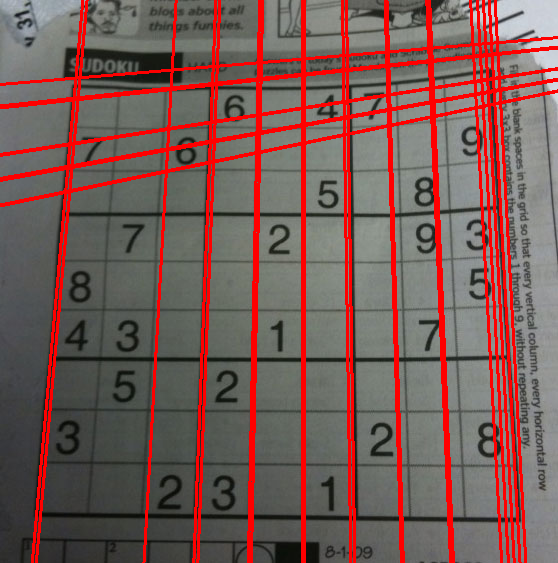
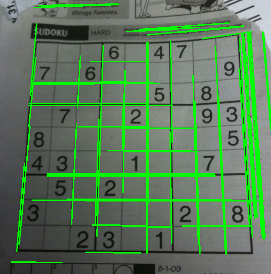
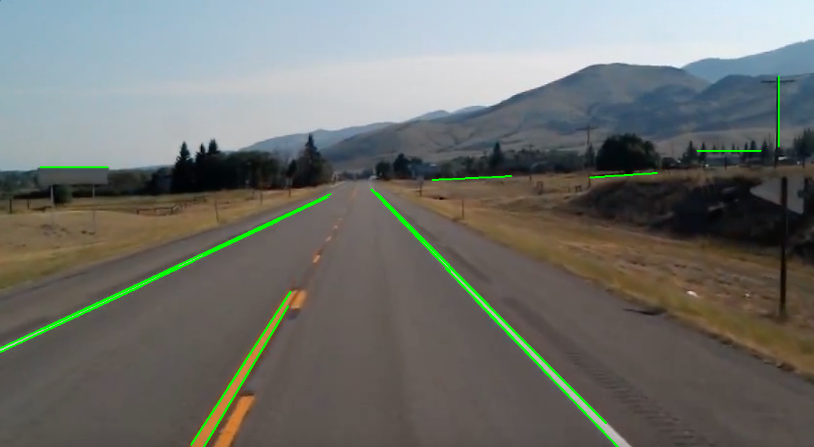
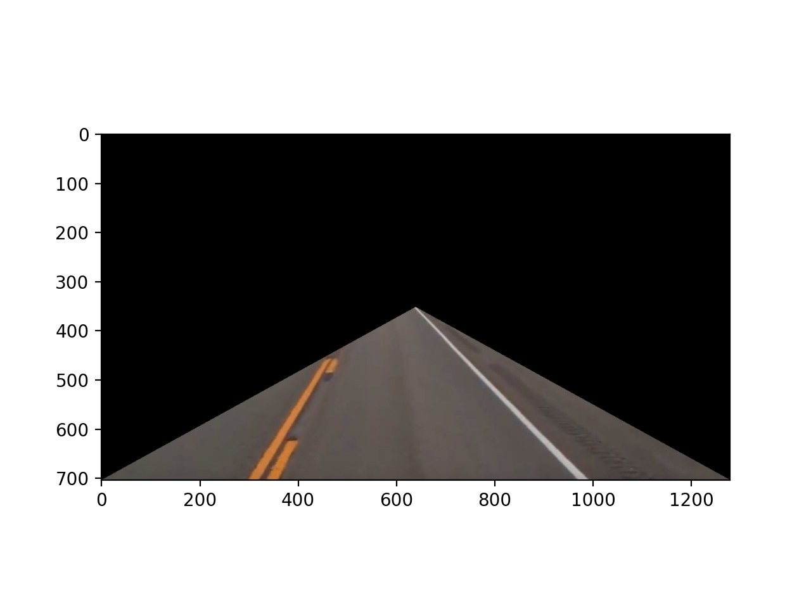
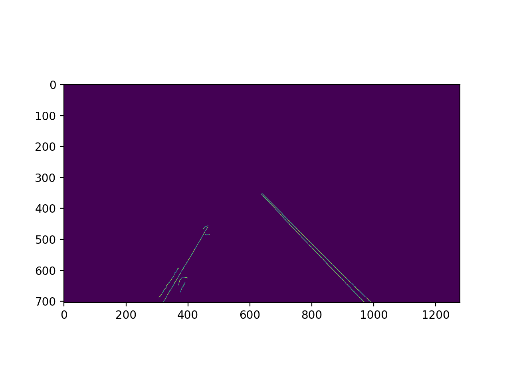
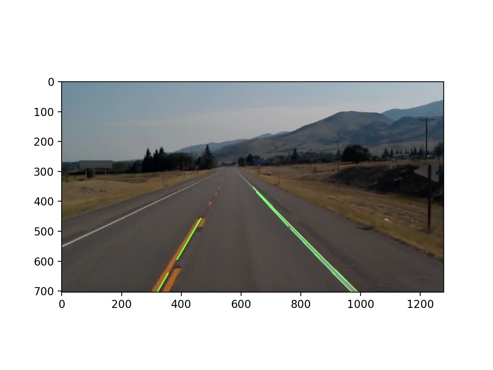
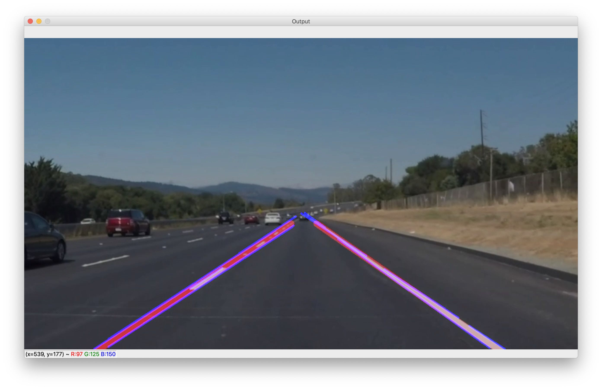

# Self Driving Car Lane Detection

## Steps to run the project

Quick note:

Running `python3 detector.py ` in terminal would show the video output
Running `python3 streamVideo.py ` in terminal would show the stream output on localhost 5000 address generated

```

1. Clone the project
2. Open the project inside terminal
3. Inside terminal type python3 detector.py
4. Inside terminal type python3 streamVideo.py

```

## Transformations & Techniques used

### ✅Hough Transformation

➡️ Yields us **`infinite lines`** on edges detected by Canny Edge Detection Method

Applying on Soduku Image:




### ✅Probabilistic Hough Transformation

➡️ Yields us **`finite lines`** on edges detected by Canny Edge Detection Method vs infinite as in case of Hough Transformation

Lets apply on a simple Soduku image: 



As you can see finite lines. Now let's apply on our Road Image :



### ✅Building out Region of Interest aka ROI



Further edge detected


Removing corner edges which are unwanted requires edge detection first then masking



Finally upon masking, 


 
 **Video Dataset**: [Click here](https://www.youtube.com/playlist?list=PLPuW_E3R2ZUltRVlWuM3ngtL3jvScTj-Y)

 **Output image**: 
 
 
